# Nexus-Geom 3D 🌌

> Interactive 3D geometry platform with 24 hyperdimensional shapes, progressive character unlocks, and full-stack scene management

<div align="center">


[🚀 Live Demo](https://nexus-geom-3d.vercel.app) • [📖 Full Documentation](./docs) • [� API Docs](./docs/TECHNICAL_SPECIFICATION.md)

</div>

## 📸 Screenshots

<div align="center">

### Landing Page (Homepage)

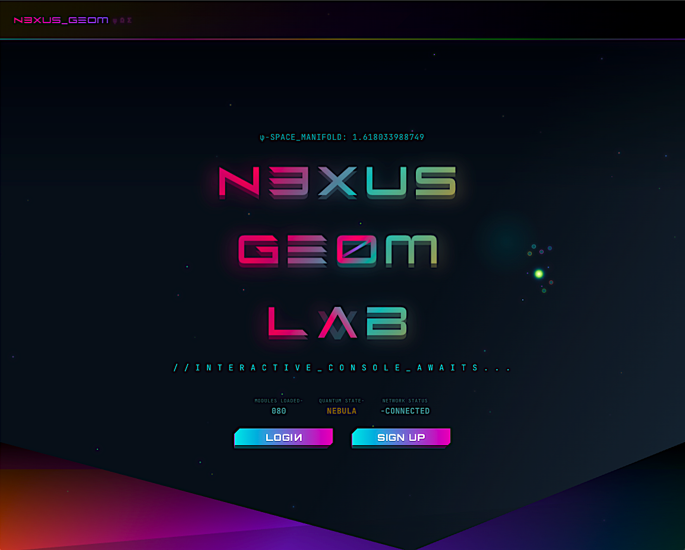
_Landing page with quantum background and navigation_

### Homepage (Logged In)

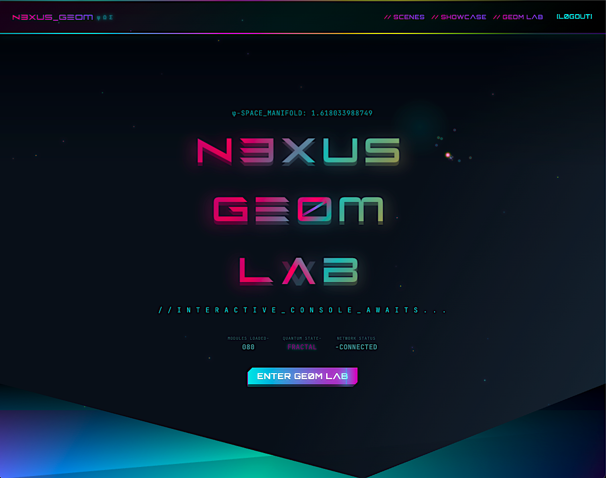
_Landing page showing authenticated user state with username and My Scenes link_

### Sign Up Page

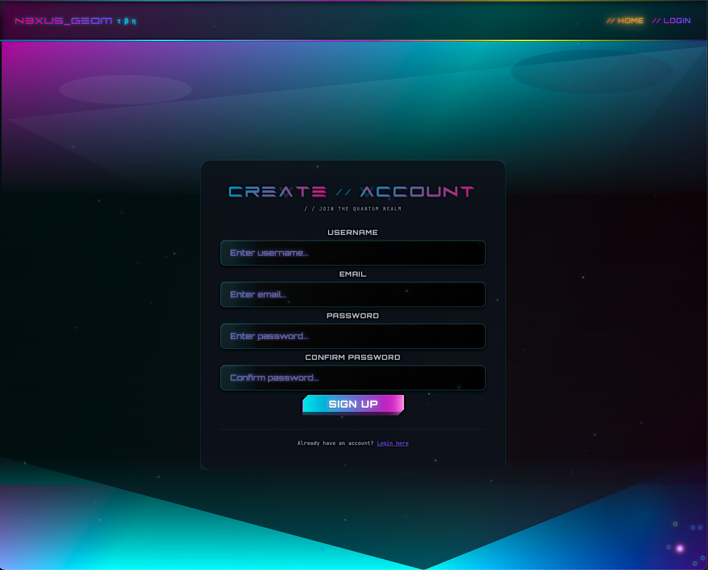
_User registration with holographic design_

### Login Page

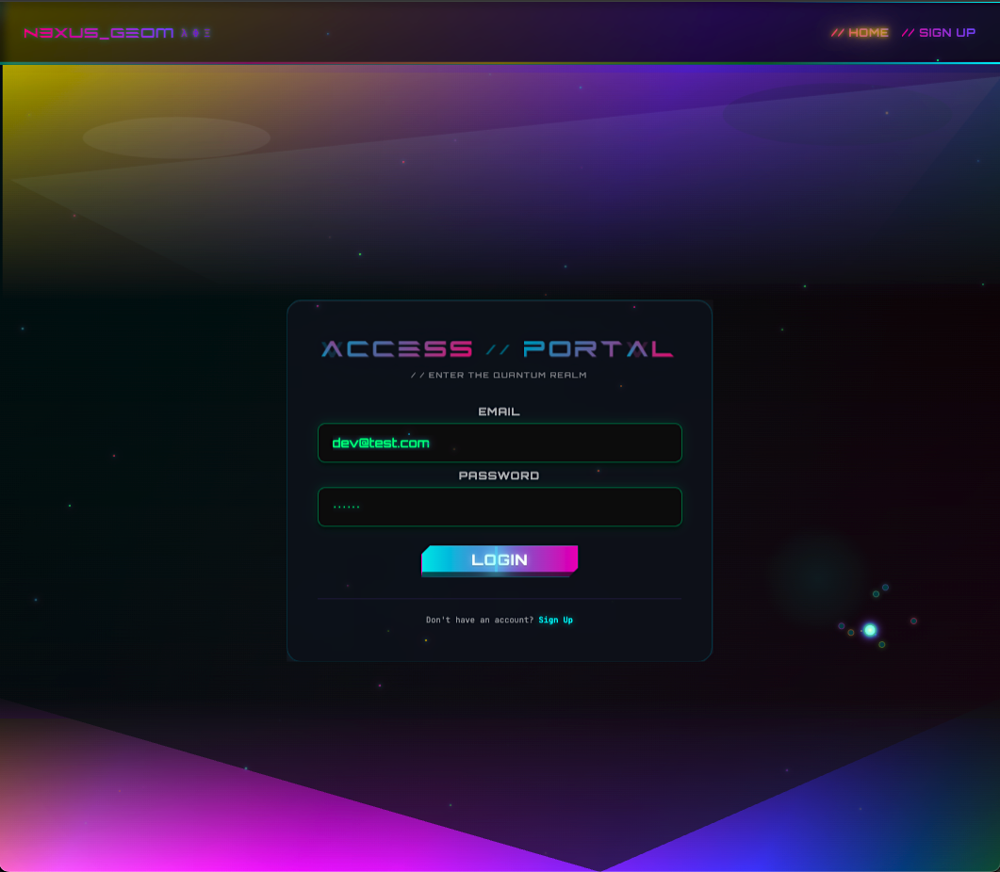
_Authentication interface with quantum styling_

### Main Geometry Lab Interface

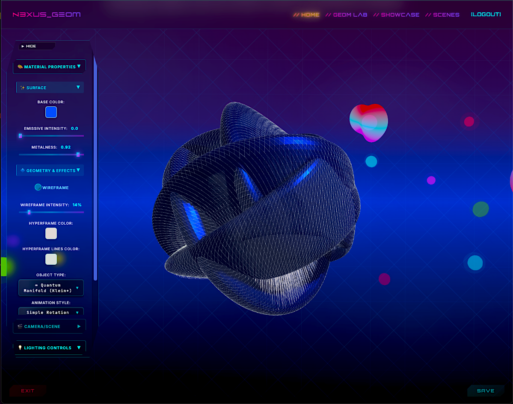
_Quantum manifold with custom hyperframe colors in matrix environment_

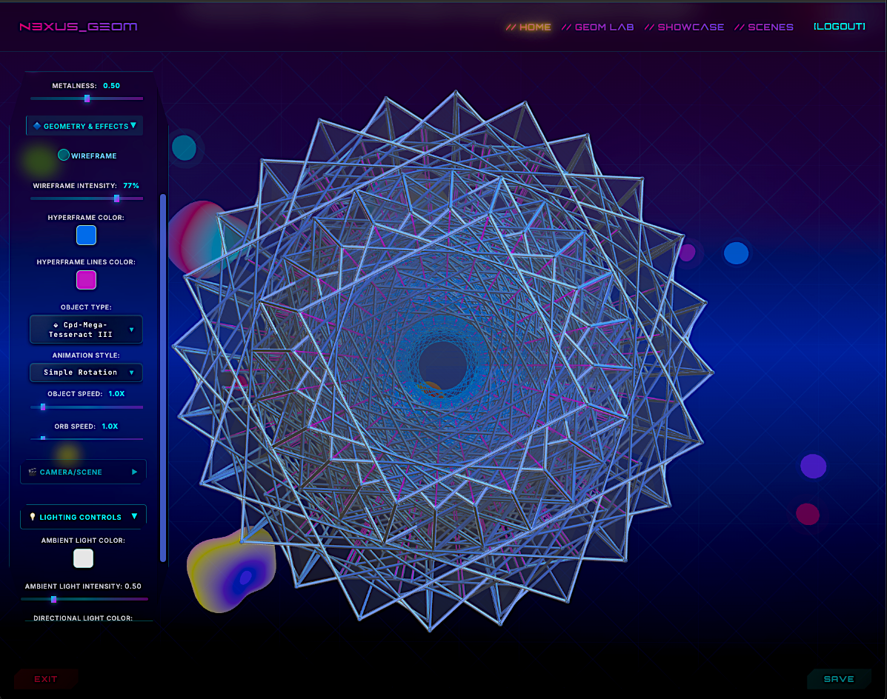
_Compound mega-tesseract III showing 4D hyperdimensional structure_

### Character Showcase Gallery

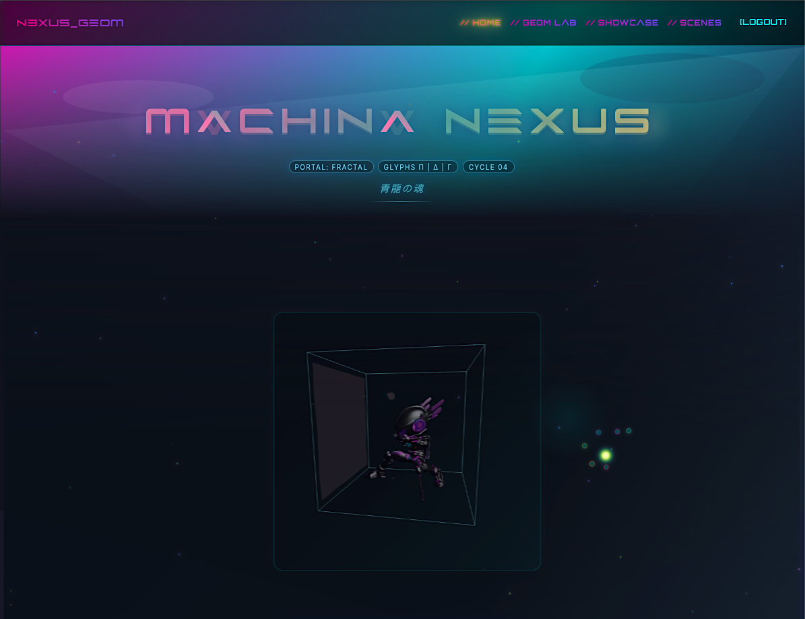
_Progressive unlock system with animated 3D characters_

### Character Viewer - Animated Detail

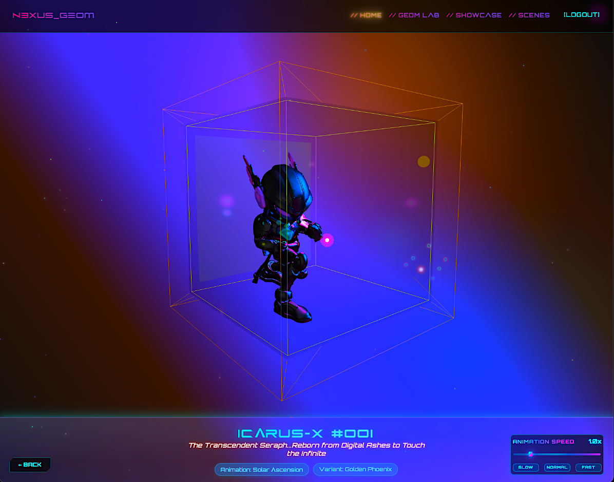
_Vectra character with holographic spellcast animation and controls_

### Scene Management Dashboard

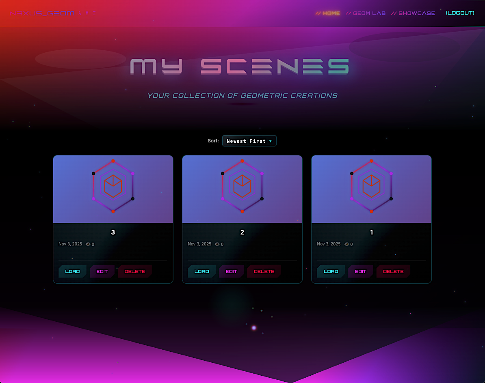
_Personal scene gallery with save/load functionality_

### Unlock Progression System

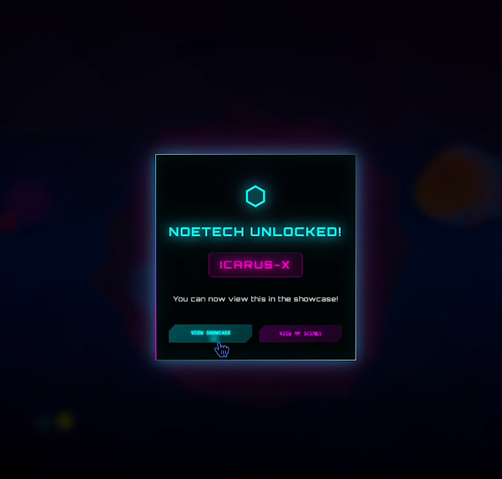
_Gamified character and animation unlocks with sound effects_

</div>

---

## 🎨 Design & Plannin

### Database Schema (ERD)

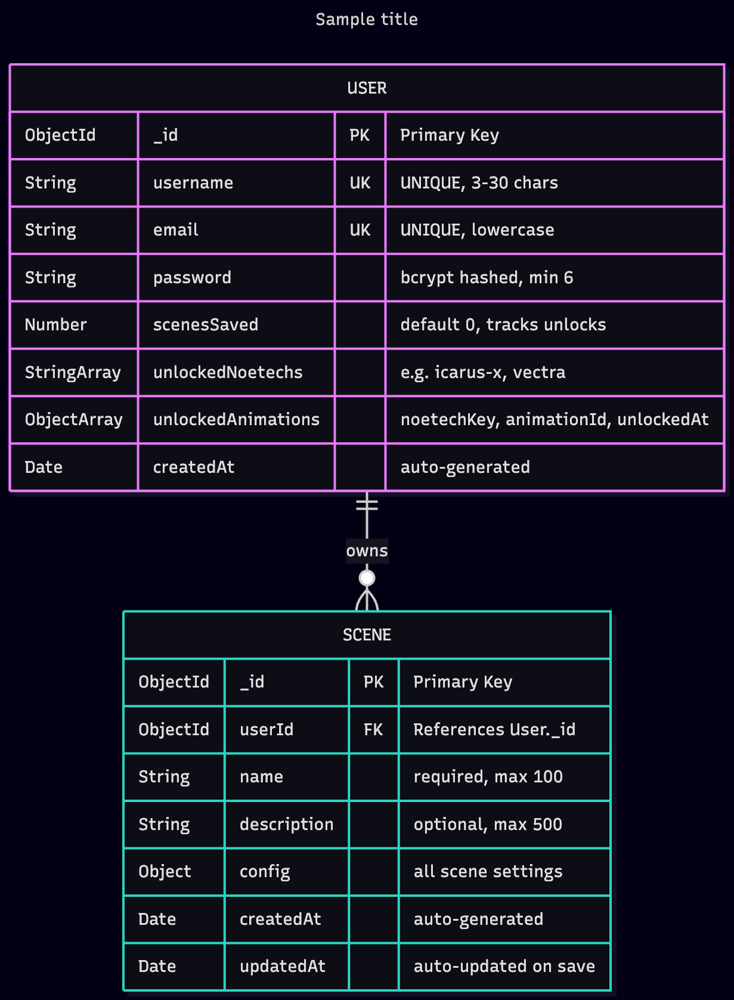
_MongoDB schema showing User, Scene, and unlock relationships_

### Application Wireframes

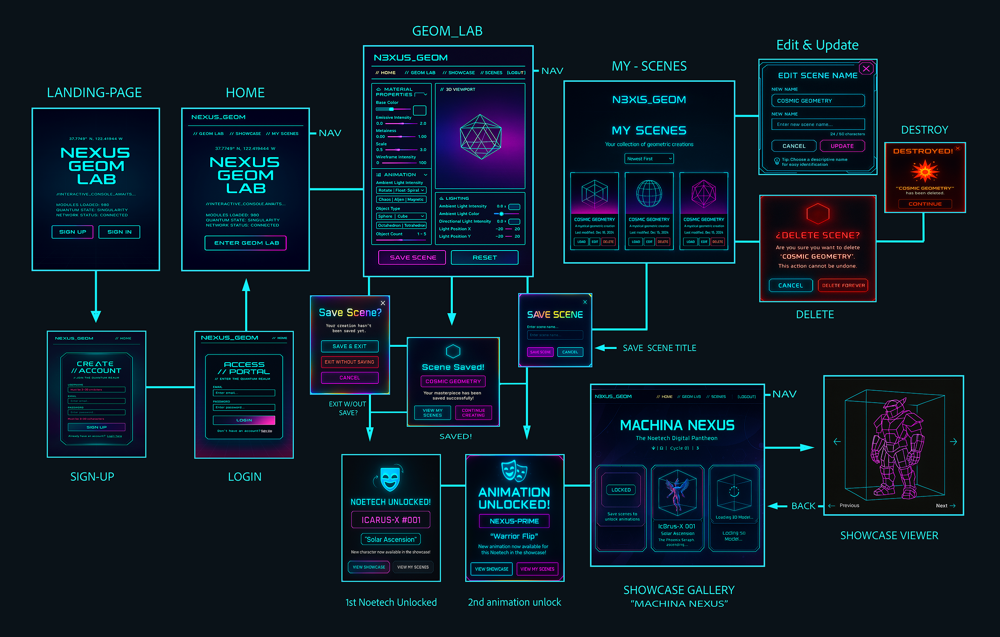
_UI/UX design and user flow planning_

**Design Process:**

- Planned data relationships before coding (ERD)
- Designed user flows and interactions (wireframes)
- Focused on quantum aesthetic with glassmorphic UI
- Progressive unlock system mapped to scene count thresholds

---

## Overview

Nexus-Geom 3D is a full-stack MERN application that transforms complex 4D mathematical concepts into an interactive, gamified 3D experience. The project is experimental and combines Three.js, React, and a custom geometry engine to let users explore, manipulate, and save hyperdimensional shapes while progressively unlocking animated characters.

**The Vision**: With a background in art and motion graphics, I wanted to build a tool that makes compound polytopes and 4D structures intuitive through interaction. I designed the spatial logic, user flow, UI aesthetic, and overall architecture, and used AI tools to assist with heavy mathematical implementation and complex Three.js scaffolding.

This project represents a fusion of artistic direction, engineering architecture, and mathematical visualization.

---

## ✨ What This App Offers Users

### 🎭 Interactive 3D Character Showcase

- View originally created 3D animated characters (Nexus Prime, Icarus-X, Vectra)
- Each character features unique visual effects:
  - **Nexus Prime**: Quantum shockwaves with spectral colors and glitch effects
  - **Icarus-X**: Digital glitch bursts and energy particles
  - **Vectra**: Holographic spellcast effects and radial geometries
- Speed controls let you slow down/speed up animations to appreciate details
- Multiple animation variants per character (unlocked through progression)
- Animation switcher to toggle between character moves

### 🌌 Immersive Visual Experience

- Custom environments for each character (skyboxes, particle effects, dynamic lighting)
- Cursor effects with gravity field and dimensional rifts
- Text scrambling animations (Katakana + code symbols) on interactive elements
- Professional glassmorphic UI design with backdrop filters
- Character-specific color themes and aesthetic palettes
- Responsive design optimized for desktop and mobile

### 💾 Scene Creation & Management

- **Create personalized scenes**: Save any geometry + animation + lighting configuration
- **Gamified progression**: Saving scenes unlocks new characters and animations
- **Personal gallery**: "My Scenes" page to organize and manage your collection
- **Full CRUD operations**: Load, edit, update, or delete your saved scenes

**The Experience**: Explore 4D geometry, discover hidden animations through saving scenes, and curate your own collection of interactive 3D moments—all in a visually stunning quantum-themed interface.

---

## 🎯 Core Features

### 🔧 Interactive Geometry Lab

- **24 Advanced Geometries**: From classical shapes to 4D polytopes and quantum manifolds
- **Real-time Controls**: Material properties (metalness, emissive intensity, wireframe blend)
- **6 Animation Algorithms**: Rotate, Float, Omni-Intellect (5-phase choreography)
- **Dynamic Lighting**: Ambient + directional lights with full 3D positioning
- **Environment System**: Quantum-themed backgrounds with 360° hue shifting
- **Audio Reactive Visuals**:
  - Microphone-driven geometry with real-time FFT (Fast Fourier Transform) analysis
  - Adaptive noise filtering with 55%/50% sensitivity thresholds
  - Frequency-to-geometry mapping:
    - Bass frequencies (20-250 Hz) → X-axis rotation + scale pulsing (only when very loud) + Z-position movement
    - Mid frequencies (250-2000 Hz) → Y/Z-axis rotation
  - **Dynamic Color Cycling**: Mesh and hyperframe change colors independently every 3 full rotations
    - Mesh uses darker complementary palette (based on base color #670d48)
    - Hyperframe uses brighter, vibrant palette for contrast
    - Creates evolving color combinations as components drift out of sync
  - Momentum-based physics with 50% friction for natural deceleration
  - Extensive tuning for responsive feel without jitter
  - Smooth acceleration with sound, natural slowdown when audio stops
  - Web Audio API integration with AudioContext and AnalyserNode
  - Real-time frequency data visualization through geometry transformations

### 🎭 Character Showcase

- **3 Animated Characters**: Icarus-X (Seraph), Vectra (Spellcaster), Nexus-Prime (Warrior)
- **Progressive Unlocks**: Characters unlock as users save scenes (gamification)
- **Multi-Animation System**: Animation switcher appears when multiple animations unlocked
- **FBX Pipeline**: Meshy → Mixamo → Blender → React Three Fiber

### 💾 Scene Management

- **Complete CRUD**: Create, Read, Update, Delete with MongoDB persistence
- **Contextual Save States**: "Save Scene" / "Transmute" / "Save As New" based on context
- **Unsaved Changes Detection**: Navigation blocking prevents accidental data loss
- **Scene Gallery**: User's personal collection with sort/filter options

### 🔐 Authentication & Security

- **JWT-based Security**: bcrypt password hashing, token-based auth
- **Protected Routes**: Scene management requires authentication
- **Session Persistence**: Users stay logged in across browser sessions
- **CORS Configuration**: Secure cross-origin requests
- **Rate Limiting**: API endpoint protection

### 🎨 Interactive UI Features

- **Text Scrambling Effects**: Katakana + code symbol animations on buttons/titles
- **Hover Controls**: Mouse-over geometry selection with real-time preview
- **Ripple Effects**: Material Design click feedback with color variants
- **Quantum Backgrounds**: Interactive color-changing environments
- **Glassmorphic Design**: Modern UI with backdrop filters and transparency
- **Responsive Layout**: Mobile-optimized interface with touch controls

### 🔊 Audio System

- **Unlock Sound Effects**: Audio feedback for character and animation unlocks
- **Sound Validation**: Robust audio system with fallback handling
- **Interactive Feedback**: Audio cues for user actions and achievements

---

## 📊 Key Technical Stats

- **2,700 → 199 lines**: 93% code reduction through custom hooks refactoring
- **21 synchronized state variables**: Real-time 3D manipulation with React state
- **Custom physics**: Transform-based + vertex-deformation animation systems
- **Factory patterns**: Modular wireframe builders for 24 geometry types
- **60fps rendering**: Optimized Three.js animation loop with complex objects

---

## 🚀 Quick Start

```bash
# Clone repository
git clone https://github.com/pablocordero/nexus-geom-3D.git
cd nexus-geom-3D

# Frontend setup
npm install
npm run dev

# Backend setup (separate terminal)
cd backend
npm install
cp .env.example .env  # Add your MongoDB URI and JWT secret
npm run dev

# Run tests
npm test                    # Run all tests once
npm test -- --watch         # Run tests in watch mode (auto-runs on file changes)

# Open http://localhost:5173
```

### Environment Variables

**Frontend `.env`:**

```env
VITE_API_URL=http://localhost:3000/api
```

**Backend `.env`:**

```env
MONGODB_URI=mongodb://localhost:27017/nexus-geom
JWT_SECRET=your-super-secret-key
CLIENT_URL=http://localhost:5173
PORT=3000
```

---

## 📁 Project Structure

```
nexus-geom-3D/
├── 📁 public/
│   ├── 📁 assets/                   # Logo and SVG assets
│   ├── 📁 fonts/                    # Future Z custom typography
│   ├── 📁 models/                   # 3D FBX character files (Icarus, Vectra, Nexus-Prime, etc.)
│   └── 📁 soundEffects/
│       └── unlock.wav               # Audio feedback for unlocks
├── 📁 src/
│   ├── App.jsx                      # Main application component
│   ├── main.jsx                     # React 19.1 entry point
│   ├── index.css                    # Global styles
│   ├── 📁 components/my object is reacing to quickly to loew noise
│   │   ├── 📁 features/             # Feature-specific components
│   │   │   └── 📁 SaveButton/       # Scene save with unlock modals
│   │   ├── 📁 layout/               # App structure (Header, Footer, etc.)
│   │   ├── 📁 pages/                # Route-level page components
│   │   ├── 📁 shared/               # Reusable UI components
│   │   └── 📁 ui/
│   │       └── 📁 ScrambleButton/   # Text animation effects
│   ├── 📁 context/
│   │   └── SceneContext.jsx         # 3D scene state management
│   ├── 📁 data/
│   │   └── portalWorlds.js          # Environment configuration data
│   ├── 📁 features/
│   │   ├── 📁 audio/
│   │   │   ├── 📁 components/
│   │   │   │   ├── AudioToggle.jsx          # Audio control UI
│   │   │   │   └── AudioToggle.module.scss  # Styles
│   │   │   └── 📁 hooks/
│   │   │       ├── useAudioAnalyzer.js      # Web Audio API + FFT
│   │   │       └── useAudioReactive.js      # Audio-to-3D mapping
│   │   ├── 📁 auth/
│   │   │   ├── 📁 context/
│   │   │   │   └── AuthContext.jsx          # JWT authentication
│   │   │   └── 📁 services/
│   │   │       └── authApi.js               # Auth API integration
│   │   └── 📁 sceneControls/
│   │       ├── ThreeScene.jsx               # Main 3D renderer
│   │       ├── ThreeScene.css
│   │       ├── controls.css
│   │       ├── 📁 animation/                # Animation systems
│   │       ├── 📁 core/
│   │       │   ├── environmentSetup.js
│   │       │   ├── lightingSetup.js
│   │       │   └── sceneSetup.js
│   │       ├── 📁 geometries/               # Geometry factory patterns
│   │       ├── 📁 hooks/                    # Scene-specific hooks
│   │       │   ├── useSceneInitialization.js
│   │       │   ├── useLightingUpdates.js
│   │       │   ├── useObjectManager.js
│   │       │   ├── useMaterialUpdates.js
│   │       │   ├── useAnimationLoop.js
│   │       │   ├── useCameraController.js
│   │       │   └── useNebulaParticles.js
│   │       ├── 📁 objects/
│   │       │   ├── geometryCreation.js
│   │       │   └── spectralOrbs.js
│   │       └── 📁 utils/                    # Scene utilities
│   ├── 📁 services/
│   │   └── sceneApi.jsx                     # Scene CRUD API
│   ├── 📁 styles/
│   │   ├── 📁 components/                   # Component-specific styles
│   │   ├── 📁 core/                         # Core style system
│   │   ├── 📁 layout/                       # Layout styles
│   │   ├── 📁 shared/                       # Shared SCSS modules
│   │   ├── shared.module.scss
│   │   ├── quantumBackground.css
│   │   └── quantumTitles.css
│   └── 📁 utils/
│       ├── 📁 handlers/                     # Event handlers
│       ├── coreHelpers.js
│       ├── geometryHelpers.js               # 3D math utilities
│       ├── textScrambler.js                 # Code symbol effects
│       ├── textScrambler.jsx                # Katakana effects
│       └── threeConstants.js                # Three.js config
├── 📁 nexus-geom-lab-backend/               # Express.js REST API
│   ├── index.js                             # Server entry
│   ├── 📁 config/
│   │   └── db.js                            # MongoDB connection
│   ├── 📁 middleware/
│   │   └── auth.js                          # JWT verification
│   ├── 📁 models/
│   │   ├── User.js                          # User schema
│   │   └── Scene.js                         # Scene schema
│   ├── 📁 routes/
│   │   ├── auth.js                          # Auth endpoints
│   │   └── scenes.js                        # Scene CRUD
│   ├── resetDevUser.js                      # Dev utility
│   └── package.json
├── 📁 docs/                                 # Technical documentation
│   ├── ARCHITECTURE_DIAGRAM.md
│   ├── INTERACTIVE_SYSTEMS.md
│   ├── TESTING_GUIDE.md
│   ├── 📁 hooks-customHooks/
│   │   ├── CUSTOM_HOOKS_GUIDE.md
│   │   └── HOOKS_INVENTORY.md
│   ├── 📁 refactoring/                      # Refactoring notes
│   └── 📁 study-plan/                       # Learning documentation
├── 📁 screenshots/                          # UI screenshots
├── index.html
├── vite.config.js
└── package.json                             # React 19.1 + Three.js 0.180
```

---

## 🏗️ Architecture Highlights

### Custom Hooks System

Refactored monolithic 2,700-line component into modular architecture:

- `useSceneInitialization` - Scene, camera, renderer setup
- `useObjectManager` - Geometry creation and updates
- `useMaterialUpdates` - Real-time material property changes
- `useLightingUpdates` - Dynamic lighting control
- `useAnimationLoop` - 60fps animation orchestration

### Advanced Wireframe System

Multi-component 3D objects with synchronized movement:

- **Solid Mesh**: Primary geometry with PBR materials
- **Thick Wireframes**: Cylinder-based edges (not thin lines)
- **Inner Structures**: Geometry-specific patterns (spirals, hyperframes)
- **Connecting Rods**: Dynamic links between inner/outer structures

### Progressive Unlock Logic

```javascript
Scene 1 → Unlock Icarus-X (Solar Ascension)
Scene 2 → Unlock Vectra (Holographic Spellcast)
Scene 3 → Unlock Nexus-Prime (Warrior Flip)
Scene 4+ → Unlock additional animations
         → Animation switcher appears!
```

---

## 🔧 Technology Stack

**Frontend:**

- React 19.1 with custom hooks architecture
- React Three Fiber for declarative Three.js components
- Three.js 0.180 for 3D rendering and WebGL
- Vite 7.1 for development and build optimization
- Context API for global state management
- SCSS Modules with glassmorphic design system
- React Router for client-side navigation
- Custom audio integration with Web Audio API

**Backend:**

- Express.js 5.x REST API with middleware pipeline
- MongoDB 5.0 with Mongoose ODM and validation
- JWT authentication with bcrypt password hashing
- CORS configuration for cross-origin requests
- Rate limiting and security headers (Helmet)
- Progressive unlock system with scene counting logic
- Express Validator for request validation

**Development Tools:**

- Jest 30.2.0 for unit testing with React Testing Library (39 passing tests)
- ESLint and Prettier for code quality
- Git hooks for automated testing
- Development user reset utilities
- Hot module replacement with Vite

**Deployment:**

- Frontend: Vercel with environment variables
- Backend: Railway/Render with MongoDB Atlas
- Database: MongoDB Atlas with connection pooling
- CDN: Asset optimization and caching

---

## 📚 Documentation

### Complete Guides

- **[Architecture Diagram](./docs/ARCHITECTURE_DIAGRAM.md)** - Visual system architecture
- **[Technical Specification](./docs/TECHNICAL_SPECIFICATION.md)** - Detailed technical documentation
- **[Custom Hooks Guide](./docs/hooks-customHooks/CUSTOM_HOOKS_GUIDE.md)** - React hooks documentation
- **[Interactive Systems](./docs/INTERACTIVE_SYSTEMS.md)** - UI/UX interaction documentation

### Quick Links

- **Installation**: See [Quick Start](#-quick-start) above
- **API Endpoints**: See [Technical Specification](./docs/TECHNICAL_SPECIFICATION.md)
- **Project Structure**: See above section

---

## 🎯 For Developers

### What This Project Demonstrates

**Advanced React Patterns**

- Custom hooks for 3D scene management
- Context API for authentication and scene state
- Complex state management (20+ synchronized variables)
- Factory patterns for object creation

**3D Graphics Programming**

- Three.js mastery with vertex manipulation
- Multi-component synchronized animations
- Custom wireframe rendering system
- Real-time material property updates

**Full-Stack Architecture**

- Express.js REST API
- MongoDB with Mongoose schemas
- JWT authentication flow
- Progressive unlock system logic

**Code Organization**

- 93% code reduction through refactoring
- Modular architecture with separation of concerns
- Factory pattern for geometry builders
- Clean boundaries between UI, 3D logic, and data

### Key Achievements

- **60fps 3D rendering** with complex multi-component objects
- **Transform-based + vertex-deformation** animation systems
- **Contextual UI** that adapts based on scene state
- **Navigation blocking** to prevent data loss
- **Progressive disclosure** through gamified unlocks
- **Real-time material updates** without scene reconstruction
- **Modular geometry factory** supporting 24 different shapes
- **Advanced lighting system** with ambient/directional controls
- **Sound effect integration** with unlock progression feedback
- **Responsive design** optimized for desktop and mobile

---

## 🚀 Deployment

**Frontend (Vercel):**

```bash
vercel
vercel env add VITE_API_URL production
```

**Backend (Railway):**

```bash
# Set environment variables:
MONGODB_URI=<mongodb-atlas-uri>
JWT_SECRET=<secure-random-string>
CLIENT_URL=<frontend-url>
NODE_ENV=production
```

---

## 🤝 Contributing

Contributions welcome! Please follow standard practices:

- Development workflow with feature branches
- ESLint and Prettier for code quality
- Clear commit messages
- Pull request with description

---

## 📄 License

MIT License - see [LICENSE](LICENSE) file for details.

Free to use, modify, and distribute. Attribution appreciated but not required.

---

## 📬 Contact

- 📧 Email: Cordero080@gmail.com
- 🐙 GitHub: [@pablocordero](https://github.com/pablocordero)
- 🐛 Issues: [Report bugs](https://github.com/pablocordero/nexus-geom-3D/issues)

---

## 🎯 Stretch Goals & Future Vision

### 🔮 Planned Enhancements

#### Blender Animation Pipeline Mastery

- **Advanced Armature Work**: IK constraints, custom bones for facial expressions
- **Material Nodes**: Procedural glowing effects matching quantum theme
- **LOD Optimization**: Multiple detail levels for performance scaling
- **Custom Animations**: Motion capture integration using Rokoko suit to record real human movements, then retarget to character armatures for nuanced, lifelike animation control

#### Social & Discovery Features

- **Public Scene Gallery**: Browse and remix community creations
- **"Remix This" System**: Clone and customize other users' scenes
- **Achievement System**: Unlock badges for mastery milestones
- **Character Evolution**: XP system, costume unlocks, power-ups

#### Advanced Rendering

- **VR/AR Integration**: WebXR support for immersive exploration
- **Ray Tracing**: Path-traced photorealistic rendering
- **Particle Systems**: Dynamic effects tied to geometry
- **Music Sync**: Real-time audio-reactive animations

#### Creative Tools

- **Animation Timeline**: Keyframe-based object choreography
- **Camera Paths**: Cinematic camera movements
- **AI Scene Generation**: "Create a quantum tesseract with purple aurora lighting"
- **Export Options**: 4K images, video recordings, JSON scene data

📖 **[Full Stretch Goals Document →](./docs/STRETCH_GOALS.md)**

---

<div align="center">

### Built with 🔥 and 🌊 by Pablo Cordero

**Tech Stack**: React • Three.js • Express.js • MongoDB • 4D Mathematics

**Features**: 3D Rendering • Real-time Controls • JWT Auth • Progressive Unlocks

**Architecture**: Custom Hooks • Factory Pattern • REST API • Modular Design

---

_"The universe is written in the language of mathematics, and its alphabet is circles, triangles, and other geometrical figures."_ - Galileo

---

⭐ **Star this repo** if you find it interesting! • 🍴 **Fork it** to experiment with your own ideas

Made in 2025 | Last Updated: November 12, 2025

</div>
